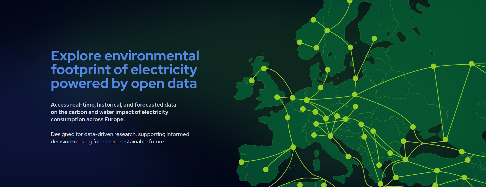

{ .home-hero__banner }

# Wattnet Documentation

Wattnet makes the environmental cost of electricity visible and actionable. It
aggregates real-time, historical and forecasted data on the **carbon** and
**water** impact of electricity consumption across Europe, and exposes it
through an open REST API.

[Get Started](user-guide/index.md){ .md-button .md-button--primary }
[Explore the API](https://api.wattnet.eu/docs){ .md-button }

This site is the central documentation hub for the Wattnet platform. Whether
you're integrating the API into your own application, researching the
methodology behind the carbon and water footprint calculations, or exploring
how the system is built, you'll find it here: from onboarding guides for
new users to deployment references for engineers running the underlying
`wattnet-api`, `wattnet-core`, and `wattnet-forecast` services.

## Explore the docs

- :material-book-open-variant: **User Guide**

    How to use the platform and interpret carbon and water footprint data.

    [Read more →](user-guide/index.md){ .card-read-more }

- :material-flask-outline: **Methodology**

    How carbon and water footprints are calculated.

    [Read more →](methodology/index.md){ .card-read-more }

- :material-sitemap-outline: **Architecture**

    System overview, C4 diagrams, and design decisions.

    [Read more →](architecture/index.md){ .card-read-more }

- :material-api: **Technical Reference**

    Deployment and configuration of `wattnet-api`, `wattnet-core`, and
    `wattnet-forecast`, including the API reference.

    [Read more →](reference/index.md){ .card-read-more }

## Key Features

- :material-lightning-bolt: **Real-time data**

    Live carbon intensity and generation mix updated across all supported
    European zones.

- :material-history: **Historical data**

    Query time series going back years to support long-term research and
    analysis.

- :material-chart-timeline: **Forecasted data**

    Day-ahead forecasts for carbon intensity and generation mix.

- :material-water: **Water footprint**

    Beyond carbon: water consumption and withdrawal metrics for each
    energy source.

- :material-map: **Zone coverage**

    All ENTSO-E bidding zones plus GB (Elexon) and Turkey (EPIAS).

- :material-api: **Open API**

    Fully documented REST API with versioning, interactive docs at
    [api.wattnet.eu/docs](https://api.wattnet.eu/docs).

## Explore Wattnet

- :material-web: **wattnet.eu**

    The Wattnet project website.

    [Visit →](https://wattnet.eu){ .card-read-more }

- :material-view-dashboard-outline: **dashboard.wattnet.eu**

    Interactive dashboard for exploring carbon and water footprint data.

    [Visit →](https://dashboard.wattnet.eu){ .card-read-more }

- :material-api: **api.wattnet.eu/docs**

    Interactive OpenAPI reference for the public REST API.

    [Visit →](https://api.wattnet.eu/docs){ .card-read-more }

## Funding and Acknowledgments

This work was developed within the [GreenDIGIT](https://greendigit-project.eu/) project, funded by the European Union's Horizon Europe research and innovation programme under grant agreement No. [101131207](https://cordis.europa.eu/project/id/101131207), and by the Swiss State Secretariat for Education, Research and Innovation (SERI).

 

## About the Service

- A service provided by the **[Spanish National Research Council (CSIC)](https://www.csic.es)**,
- Deployed on the **Scientific Cloud** at the **[Institute of Physics of Cantabria (IFCA)](https://ifca.unican.es/)**.
- Developed by the **[IFCA Advanced Computing and e‑Science Group](https://advancedcomputing.ifca.es)**.

## Trademark Information

The name **WATTNET** and the **Wattnet Logo** are official registered trademarks of the Spanish National Research Council (CSIC), recorded with the European Union Intellectual Property Office (EUIPO). The word mark is registered under [EUTM Application No. 019266832](https://euipo.europa.eu/eSearch/#details/trademarks/019266832), and the logo mark under [EUTM Application No. 019267422](https://euipo.europa.eu/eSearch/#details/trademarks/019267422).
