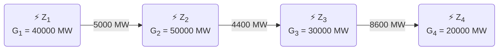

---
tags:
    - Methodology
    - Flow tracing
---

# Flow Tracing

These examples illustrate the flow tracing methodology used to attribute
power flows in a simplified power network. The examples demonstrate how
generation from different sources is traced through the network to various
loads.

They also show how the result of applying the flow tracing algorithm is
used in Wattnet to compute the contribution of each generator to the load
at each node.

## Basic Example

Consider a simple network with four nodes (Z1, Z2,
Z3, Z4). Each node has a generator with a specified
capacity (power in watts), and there are power flows between the nodes as
shown below:

From this network state diagram we can extract the following information
directly:

- **Generation Vector:** Represents the generation at each node.

    $\vec{G} = [40000, 50000, 30000, 20000] \, \text{MW}$

- **Import Vector:** Represents the total imports at each node.

    $\vec{I} = [0, 5000, 4400, 8600] \, \text{MW}$

- **Export Vector:** Represents the total exports at each node.

    $\vec{E} = [5000, 4400, 8600, 0] \, \text{MW}$

Other relevant vectors can also be computed using these basic vectors and
their relationships:

- **Total Flow Vector:** Represents the total power available at each node
  before accounting for exports (generation + imports).

    !!! note

            This has to be before exports when using the upstream-looking flow
            tracing algorithm.

    $\vec{P} = \vec{G} + \vec{I} = [40000, 55000, 34000, 28600] \, \text{MW}$

- **Load Vector:** Represents the total load at each node after accounting
  for exports (generation + imports - exports).

    $\vec{L} = \vec{G} + \vec{I} - \vec{E} = [35000, 50600, 25800, 28600] \, \text{MW}$

- **Contribution Vector:** Represents the fraction of power at each node
  that is used to meet local load.

    $\vec{C} = \frac{\vec{L}}{\vec{P}} = [0.875, 0.92, 0.75, 1.0]$

### Flow Tracing Upstream Distribution Matrix

The flow tracing upstream distribution matrix $\mathbf{A_u}$ is
constructed to represent the contribution of each generator to the power
at each node. Each element $A_{ij}$ in the matrix represents the fraction
of power at node $i$ that originates from generator $j$. In this case:

- The **columns** of the matrix represent the **nodes of origin** (where
  the power comes from).
- The **rows** represent the **nodes of destination** (where the power
  flows to).

The $(i,j)$ element of the flow tracing matrix is computed as follows:

$$
\mathbf{A_{ij}} =
\begin{cases}
1 & \text{if } i = j \\
-\frac{|P_{j-i}|}{P_j} & \text{for each } j \in \text{I}(i) \\
0 & \text{otherwise}
\end{cases}
$$

So for our example, the upstream distribution matrix $\mathbf{A_u}$ is:

$$
\mathbf{A_u}^T =
\begin{bmatrix}
1 & 0 & 0 & 0 \\
-\frac{5000}{40000} & 1 & 0 & 0 \\
0 & -\frac{4400}{55000} & 1 & 0 \\
0 & 0 & -\frac{8600}{34400} & 1
\end{bmatrix}
\ =
\begin{bmatrix}
1 & 0 & 0 & 0 \\
-0.125 & 1 & 0 & 0 \\
0 & -0.08 & 1 & 0 \\
0 & 0 & -0.25 & 1
\end{bmatrix}
$$

Inverting this matrix gives the downstream contribution of each node's
power to every other node it feeds. The inverse of the upstream
distribution matrix $\mathbf{A_u}^{-1}$ is:

$$
\mathbf{A_u}^{-1} =
\begin{bmatrix}
1 & 0 & 0 & 0 \\
0.125 & 1 & 0 & 0 \\
0.01 & 0.08 & 1 & 0 \\
0.0025 & 0.02 & 0.25 & 1
\end{bmatrix}
$$

### Distribution of Power Using the Upstream-Looking Flow Tracing Algorithm

Using the upstream-looking flow tracing algorithm, we can compute the
contribution of each generator to the load at each node.

| Load / Generation | G1                                      | G2                                      | G3                                      | G4                                      |
| ----------------- | -------------------------------------------------- | -------------------------------------------------- | -------------------------------------------------- | -------------------------------------------------- |
| **L1** | $\vec{C}_1 \cdot \mathbf{A_u}^{-1}_{ij} \cdot G_1$ | $\vec{C}_1 \cdot \mathbf{A_u}^{-1}_{ij} \cdot G_2$ | $\vec{C}_1 \cdot \mathbf{A_u}^{-1}_{ij} \cdot G_3$ | $\vec{C}_1 \cdot \mathbf{A_u}^{-1}_{ij} \cdot G_4$ |
| **L2** | $\vec{C}_2 \cdot \mathbf{A_u}^{-1}_{ij} \cdot G_1$ | $\vec{C}_2 \cdot \mathbf{A_u}^{-1}_{ij} \cdot G_2$ | $\vec{C}_2 \cdot \mathbf{A_u}^{-1}_{ij} \cdot G_3$ | $\vec{C}_2 \cdot \mathbf{A_u}^{-1}_{ij} \cdot G_4$ |
| **L3** | $\vec{C}_3 \cdot \mathbf{A_u}^{-1}_{ij} \cdot G_1$ | $\vec{C}_3 \cdot \mathbf{A_u}^{-1}_{ij} \cdot G_2$ | $\vec{C}_3 \cdot \mathbf{A_u}^{-1}_{ij} \cdot G_3$ | $\vec{C}_3 \cdot \mathbf{A_u}^{-1}_{ij} \cdot G_4$ |
| **L4** | $\vec{C}_4 \cdot \mathbf{A_u}^{-1}_{ij} \cdot G_1$ | $\vec{C}_4 \cdot \mathbf{A_u}^{-1}_{ij} \cdot G_2$ | $\vec{C}_4 \cdot \mathbf{A_u}^{-1}_{ij} \cdot G_3$ | $\vec{C}_4 \cdot \mathbf{A_u}^{-1}_{ij} \cdot G_4$ |

This table shows how the load at each node is met by generation from
different sources, illustrating the flow tracing methodology in action.
The actual numerical values can be computed by performing the matrix
multiplication and applying the contribution factors, as follows:

| Load / Generation | G1 | G2 | G3 | G4 | Total  |
| ----------------- | ------------- | ------------- | ------------- | ------------- | ------ |
| **L1** | 35000         | 0             | 0             | 0             | 35000  |
| **L2** | 4600          | 46000         | 0             | 0             | 50600  |
| **L3** | 300           | 3000          | 22500         | 0             | 25800  |
| **L4** | 100           | 1000          | 7500          | 20000         | 28600  |
| Total             | 40000         | 50000         | 30000         | 20000         | 140000 |

### Distribution and Composition Vectors Defined in Wattnet

In Wattnet, the distribution and composition vectors are defined as
follows:

- **Distribution Vector:** Represents the distribution (percentage) of
  generation from each source to each load. This is essentially reading
  the table above by columns. The percentage is
  $\vec{C}_{i} \cdot \mathbf{A_u}^{-1}_{ij}$. In this case:
    - Z1 distribution vector: $[0.875, 0.115, 0.0075, 0.0025]$
    - Z2 distribution vector: $[0.0, 0.92, 0.06, 0.02]$
    - Z3 distribution vector: $[0.0, 0.0, 0.75, 0.25]$
    - Z4 distribution vector: $[0.0, 0.0, 0.0, 1.0]$

- **Composition Vector:** Represents the composition (percentage) of each
  load that is met by each generation source. This is essentially reading
  the table above by rows. The percentage is
  $\frac{\vec{C}_{i} \cdot \mathbf{A_u}^{-1}_{ij} \cdot G_j}{L_i}$. In this
  case:
    - Z1 composition vector: $[1.0, 0.0, 0.0, 0.0]$
    - Z2 composition vector: $[0.0909090909090909, 0.9090909090909091, 0.0, 0.0]$
    - Z3 composition vector: $[0.0116279069767442, 0.116279069767442, 0.872093023255814, 0.0]$
    - Z4 composition vector: $[0.0034965034965035, 0.034965034965035, 0.262237762237762, 0.6993006993006993]$

These vectors provide insights into how power generation is distributed
across the network and how each load is composed of contributions from
different generation sources.

### Global Footprint Calculation

The global footprint for each zone can be calculated by taking a weighted
sum of local footprints, weighted by the composition vector for that zone.

Given the local footprints for each zone as follows:

| Zone          | Local Footprint (gCO2/kWh) |
| ------------- | ------------------------------------- |
| Z1 | 100                                   |
| Z2 | 200                                   |
| Z3 | 300                                   |
| Z4 | 400                                   |

The global footprint for each zone can be calculated as follows:

- **Global Footprint for Z1:**

    $$
    \text{Global Footprint}_{Z_1} = 1.0 \cdot 100 + 0.0 \cdot 200 + 0.0 \cdot 300 + 0.0 \cdot 400 = 100 \, \text{gCO2/kWh}
    $$

- **Global Footprint for Z2:**

    $$
    \text{Global Footprint}_{Z_2} = 0.0909090909090909 \cdot 100 + 0.9090909090909091 \cdot 200 + 0.0 \cdot 300 + 0.0 \cdot 400 = 190.9090909090909 \, \text{gCO2/kWh}
    $$

- **Global Footprint for Z3:**

    $$
    \text{Global Footprint}_{Z_3} = 0.0116279069767442 \cdot 100 + 0.116279069767442 \cdot 200 + 0.872093023255814 \cdot 300 + 0.0 \cdot 400 = 272.093023255814 \, \text{gCO2/kWh}
    $$

- **Global Footprint for Z4:**

    $$
    \text{Global Footprint}_{Z_4} = 0.0034965034965035 \cdot 100 + 0.034965034965035 \cdot 200 + 0.262237762237762 \cdot 300 + 0.6993006993006993 \cdot 400 = 361.53846153846155 \, \text{gCO2/kWh}
    $$
