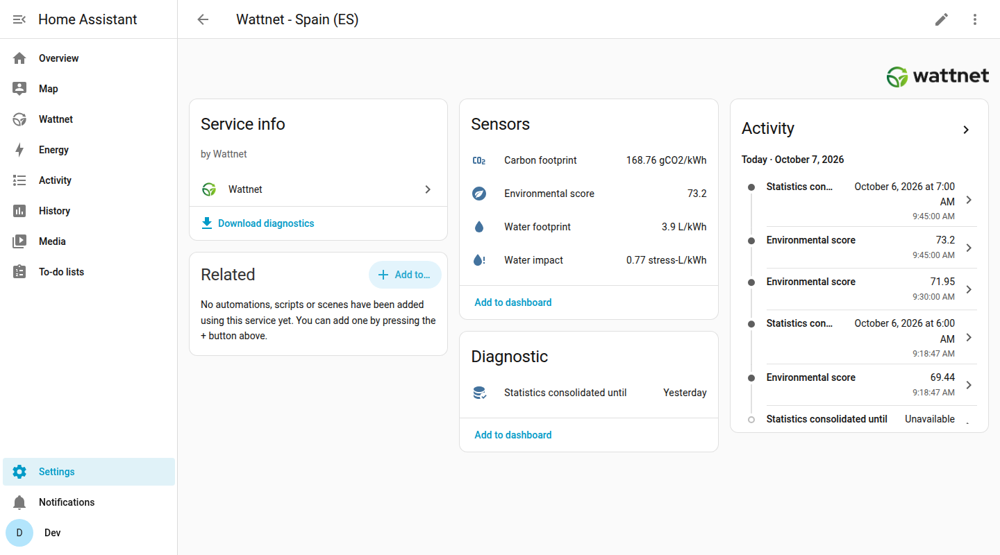
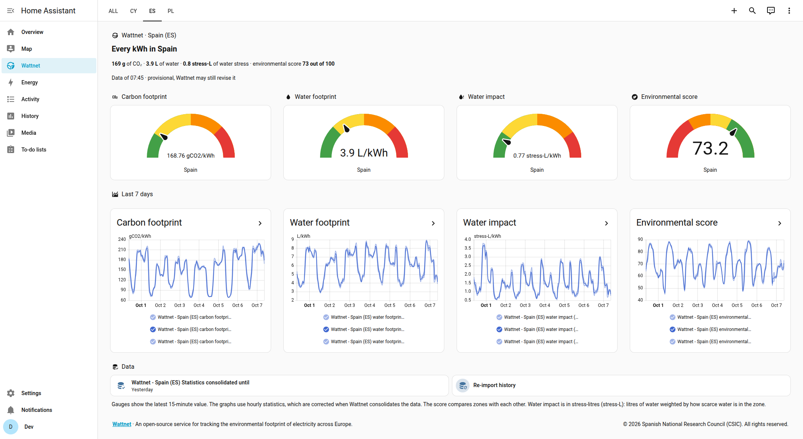
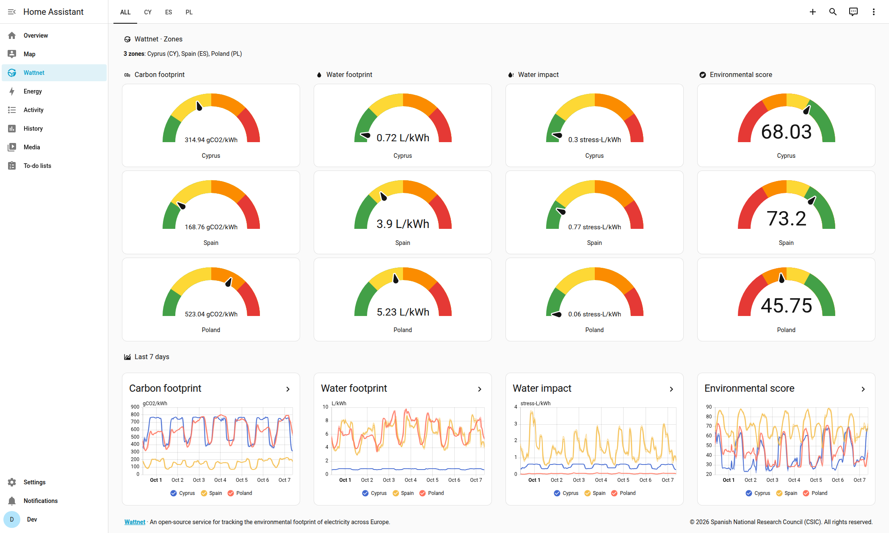

---
tags:
  - Home Assistant
  - Guide
---

# Dashboard and entities

Each zone you set up creates one device with a few sensors, and the integration adds a **Wattnet** dashboard to the sidebar that shows them.

## The device and its sensors

Open **Settings > Devices & services**, then the Wattnet integration and the device of a zone to see its sensors.

{ loading=lazy }

| Sensor | Unit | What it is |
| --- | --- | --- |
| Carbon footprint | `gCO2/kWh` | Grams of CO2 emitted to produce each kWh of the zone. |
| Water footprint | `L/kWh` | Litres of water used to produce each kWh. |
| Water impact | `stress-L/kWh` | The water footprint weighted by how scarce water is in the zone. |
| Environmental score | 0 to 100 | How the zone ranks against the others. Higher is better. |
| Statistics consolidated until | timestamp | Diagnostic. The first hour whose data Wattnet has not consolidated yet. |

The water impact and the environmental score are always operational. The carbon and water footprints follow the scope you chose when you set up the zone.

Every sensor carries these attributes, which you can use in templates and automations:

- `valid`: `true` when the latest data point is consolidated and immutable.
- `zone_status`: `complete`, `preview` or `missing`, as reported by Wattnet.
- `data_timestamp`: the time of the latest data point.

The values are the factors that Wattnet publishes for each zone, per kWh. They describe the electricity grid of the zone, not the consumption of your home.

## The Wattnet dashboard

The dashboard is generated by the integration from the zones and entities of your Home Assistant, so you do not have to build anything. It is read-only, like a dashboard defined in YAML, and it is updated when you add or remove a zone. It does not touch your own dashboards.

### One zone

With one zone the dashboard is a single page.

{ loading=lazy }

From top to bottom it shows:

- **A headline** with the footprint of a kWh right now, for example "Every kWh in Spain", followed by the carbon, the water, the water stress and the environmental score on one line, and the time of the data with a note saying whether it is provisional or consolidated.
- **A gauge for each metric**: carbon footprint, water footprint, water impact and environmental score. For the first three, green is low and red is high. For the score it is the other way round, since higher is better.
- **The last 7 days** of each metric, drawn from the corrected statistics.
- **Your consumption**, when your Energy dashboard has a grid source: the CO2, water and water impact of the electricity you used today, and bars per day. See [Energy dashboard](home-assistant-reference.md#energy-dashboard).
- **The consolidation marker** and, beside it, a tile that re-imports the history of the zone when you press it.

### Several zones

With several zones the dashboard starts with an **ALL** tab that compares them, followed by one tab per zone named with its code, sorted by code.

{ loading=lazy }

The **ALL** tab has a one-line summary of the zones, a column of gauges for each metric with one gauge per zone, and the graphs of the last 7 days with every zone drawn in them. Each zone tab has the same layout as the single zone page.

### Where it lives

The dashboard appears in **Settings > Dashboards** and disappears when you remove the last zone. If you do not want it, turn off **Show the Wattnet dashboard** in the [options](home-assistant-reference.md#options) of a zone. To customise it, copy the cards you like into a dashboard of your own.

## Use the sensors in your own dashboards

The sensors work like any other sensor, for example in a gauge or an entity card. For history graphs use the statistics instead of the sensor history, because they are corrected when Wattnet consolidates the data. In a **Statistics graph** card, pick the statistic ids that start with `wattnet:`. See [Statistics](home-assistant-reference.md#statistics).
