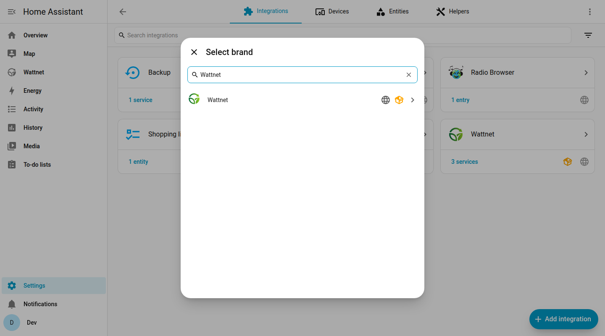
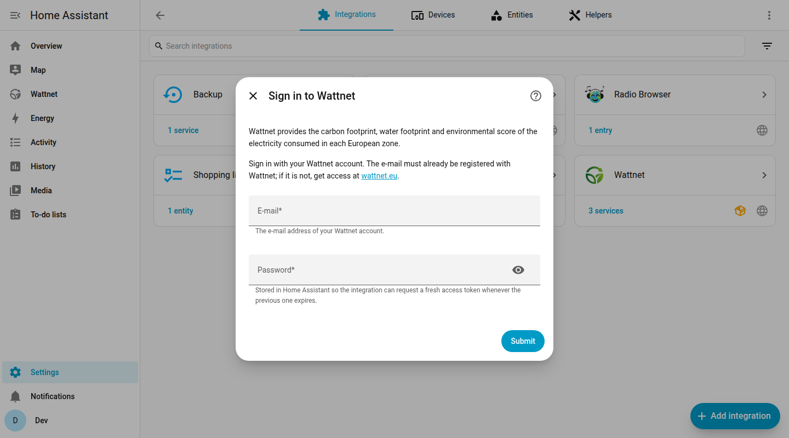
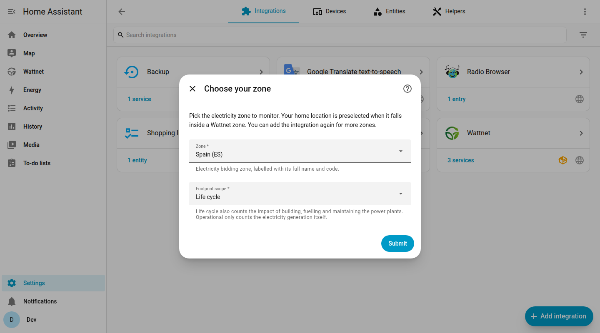
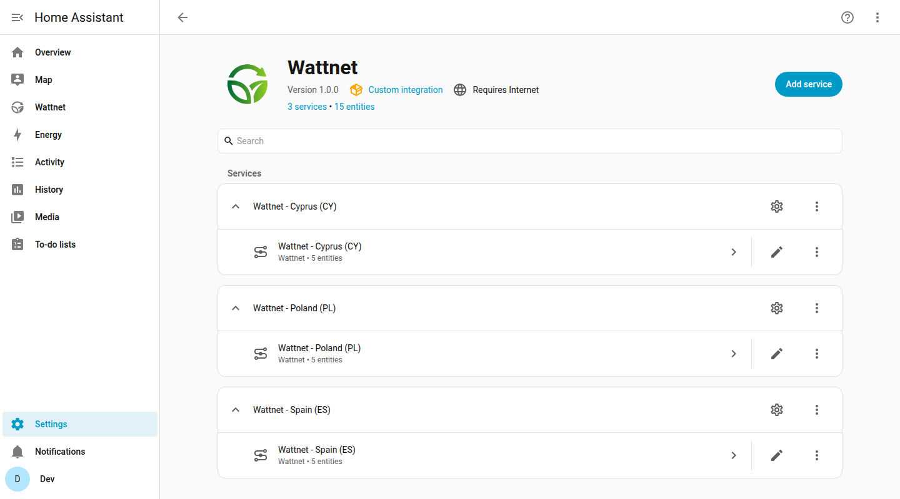
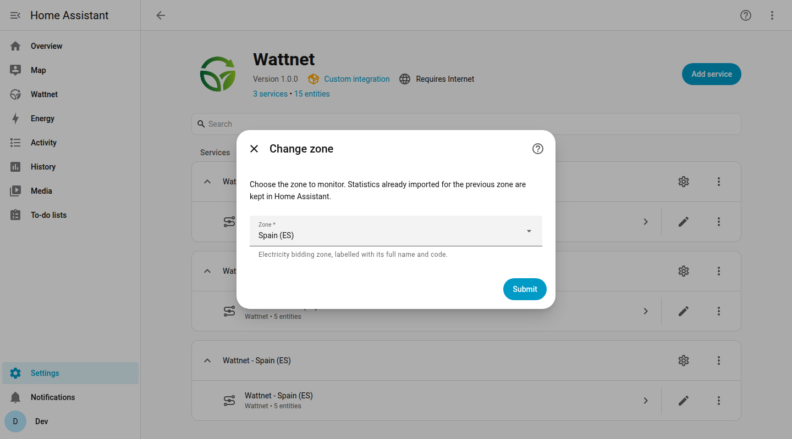

---
tags:
  - Home Assistant
  - Guide
---

# Home Assistant Integration

The Wattnet integration brings the carbon footprint, water footprint, water impact and environmental score of the electricity consumed in your zone into [Home Assistant](https://www.home-assistant.io/). It is built on the official [Python client](../python-client/python-client-quickstart.md) and on the [Wattnet API](../api/api-access.md).

{ loading=lazy }

## What you get

- **Sensors** with the latest value of each metric in the zone you choose, so you can use them in automations, scripts and your own dashboards.
- **Long-term statistics** with the history of each metric, so the graphs of Home Assistant show the data with the right timestamps. Recent data is published as provisional and later consolidated by Wattnet, and the integration corrects the history by itself when that happens.
- **A ready-made dashboard** in the sidebar, with gauges and graphs for every zone you set up. See [Dashboard and entities](home-assistant-dashboard.md).
- **Your own footprint**: when your Energy dashboard has a grid source, the integration crosses your consumption with the footprint of each kWh. See [Reference](home-assistant-reference.md#energy-dashboard).

## Requirements

- Home Assistant 2025.11 or newer.
- A Wattnet account. The e-mail and password are the ones you registered with the token service, as described in [API Access](../api/api-access.md). Access is currently granted on request through [wattnet.eu/contact](https://wattnet.eu/contact).

## Installation

### With HACS (recommended)

!!! note "Install HACS first"
    [HACS](https://hacs.xyz/) (the Home Assistant Community Store) is not part of Home Assistant, so you have to install it once before you can use it. Follow the official guide: [Download HACS](https://hacs.xyz/docs/use/download/download/). If you already have it, go on with the steps below. For more about adding a repository that is not in the HACS list, see [Custom repositories](https://hacs.xyz/docs/faq/custom_repositories/).

1. In HACS, open the menu in the top right corner and choose **Custom repositories**.
2. Add `https://github.com/wattnet/wattnet-home-assistant` with the category **Integration**.
3. Search for **Wattnet**, download it and restart Home Assistant.

### Manual

Copy the `custom_components/wattnet` folder of the [GitHub repository](https://github.com/wattnet/wattnet-home-assistant) into the `custom_components` folder of your Home Assistant configuration and restart Home Assistant.

## Set up the integration

Go to **Settings > Devices & services**, press **Add integration** and search for **Wattnet**.

{ loading=lazy }

### 1. Sign in

Enter the e-mail and password of your Wattnet account. The e-mail must already be registered with Wattnet.

{ loading=lazy }

!!! note "Why an e-mail and password, and not a token"
    A token expires after one day. With the e-mail and password the integration requests a fresh token whenever it needs one, so it never stops working when a token expires. The password is stored in your Home Assistant.

### 2. Choose the zone and the scope

Pick the electricity zone to monitor. Your home location is preselected when it falls inside a Wattnet zone. Then pick the footprint scope:

- **Life cycle** also counts the impact of building, fuelling and maintaining the power plants.
- **Operational** only counts the electricity generation itself.

{ loading=lazy }

### 3. Done

The integration creates one device with its sensors and adds the **Wattnet** dashboard to the sidebar. The sensors are ready right away, while the history is downloaded in the background, so Home Assistant is never slowed down by it. After a few minutes the graphs of the last 7 days are complete.

{ loading=lazy }

## Monitor more zones

One entry is created per zone. To monitor more zones, press **Add service** in the Wattnet integration page and repeat the steps above. With several zones the dashboard compares them all.

## Change the zone

Open the menu of an entry (the three dots) and choose **Reconfigure**. The statistics already imported for the previous zone are kept in Home Assistant.

{ loading=lazy }

## Next steps

- [Dashboard and entities](home-assistant-dashboard.md): what the dashboard and the sensors show.
- [Reference](home-assistant-reference.md): options, statistics, the Energy dashboard, the action to re-import history and troubleshooting.
