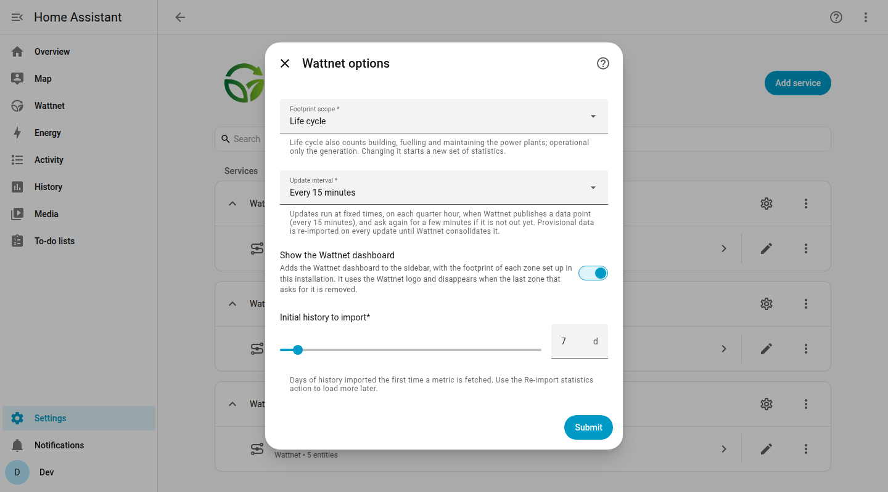

---
tags:
  - Home Assistant
  - Reference
---

# Home Assistant Reference

This page describes the options of the integration, the statistics it imports, how it uses your Energy dashboard, the action to re-import history and the answers to the most common questions. For the installation, see [Home Assistant Integration](home-assistant-installation.md).

## Options

Open **Settings > Devices & services > Wattnet**, then the gear of a zone, to change its options.

{ loading=lazy }

| Option | Default | Description |
| --- | --- | --- |
| Footprint scope | `life-cycle` | Scope used for the carbon and water footprints. Changing it starts a new set of statistics. |
| Update interval | 15 minutes | Every 15 minutes, every 30 minutes or every hour. |
| Show the Wattnet dashboard | on | Adds the Wattnet dashboard to the sidebar. |
| Initial history to import | 7 days | Days of history imported the first time a metric is fetched. |

## How the data is updated

Wattnet publishes one data point every 15 minutes. The integration updates at fixed minutes of the hour (0, 15, 30 and 45 for the 15 minute interval), so a state lands in the history as close as possible to the time of its data point. The point of the new quarter is usually not published at that exact moment, so the integration asks again every minute for up to five minutes until it is. The exact time of the data is always in the `data_timestamp` attribute.

If Wattnet stops responding, the last data is kept for an hour. After that the sensors become unavailable and a repair issue appears. Everything recovers by itself when the API is back.

## Statistics

Besides the sensors, the integration imports the history of each metric as long-term statistics, with the ids:

```
wattnet:<zone>_<metric>[_<scope>]
```

For example, `wattnet:es_carbon_footprint_life_cycle`. Wattnet data comes every 15 minutes while Home Assistant statistics are hourly, so the four points of each hour are averaged, and the minimum and maximum are kept too.

### Provisional and consolidated data

Wattnet publishes recent data first as provisional (`valid: false`) and later consolidates it (`valid: true`, immutable). The integration keeps importing the provisional hours again on every update, replacing the earlier values, until Wattnet consolidates them. An hour counts as consolidated only when it has all four points and every one of them is consolidated, so the current hour is never frozen with a partial average. The diagnostic sensor **Statistics consolidated until** shows how far the consolidation has gone.

The sensors have no state class on purpose. Otherwise Home Assistant would also compile statistics from the polled states, stamped with the poll time and never corrected, next to the consolidated ones. Use the `wattnet:` statistics for history graphs.

## Energy dashboard

The Energy dashboard has no place for the carbon footprint of a third party, because it only reads the grid carbon signal from another integration. What the Wattnet integration can do is combine your own grid consumption with the Wattnet footprints.

When your Energy dashboard has a grid source, the integration reads its consumption meters. For each hour it adds `kWh drawn from the grid x footprint of that kWh` to a running total, and creates these statistics for each zone:

| Statistic id | Unit | What it is |
| --- | --- | --- |
| `wattnet:<zone>_grid_water_consumption_<scope>` | `L` | Litres of water behind the electricity you consumed. |
| `wattnet:<zone>_grid_carbon_emissions_<scope>` | `g` | Grams of CO2 emitted to produce it. |
| `wattnet:<zone>_grid_water_impact` | `stress-L` | Water stress impact of that electricity. |

The dashboard of the integration uses them in its **Your consumption** section.

### Show the water in the Energy dashboard

Go to **Settings > Dashboards > Energy**, then **Water consumption > Add water source**, and choose `Wattnet - Spain (ES) grid water consumption` (or the zone of your home). The integration does not change your Energy configuration by itself. The carbon and impact totals do not appear in the Energy dashboard, but you can draw them with a **Statistics graph** card using their ids.

Use the entry of the zone where your home is, since the footprint of a kWh depends on the zone that produced it.

### How the totals are calculated

- Each hour uses the mean of the footprints of that hour and the kWh your meter recorded in it. The meters can be in any energy unit and several grid meters are added together.
- The hour in progress is left out until it finishes, because its consumption is still partial.
- An hour for which Wattnet has no data adds nothing, so the total stays continuous.
- A provisional hour is recalculated, and every total after it, when Wattnet consolidates it.
- Some meters publish their consumption a day or two late, so the last 3 days are recalculated on every update.
- If the Energy dashboard had no grid when the integration started, only the data of the next updates is calculated. Run the re-import action to calculate the previous days.

## Actions

### `wattnet.reimport_statistics`

Forgets what was imported and downloads the last days of data again, replacing the statistics. Use it after a long gap or to load more history than the initial import. You can run it from **Developer tools > Actions**, or press the re-import tile of the dashboard.

| Field | Required | Description |
| --- | --- | --- |
| `config_entry` | no | The zone to re-import. Every zone when omitted. |
| `days` | no | Days of history, 1 to 90. Defaults to the initial history option. |

## Diagnostics

Each device has a **Download diagnostics** link, with the state of the integration to attach to a bug report.

## Frequently asked questions

### Home Assistant was off for a while. Is the missing data filled in?

Yes. The integration stores the first hour that is not consolidated yet and, on the next update after starting, asks Wattnet for everything from there on. The statistics are completed by themselves, with the original time of each hour. The initial history option is only used the first time a zone is fetched.

There is one exception. The statistics derived from your grid consumption need the energy statistics that your own meter recorded, and those cannot be rebuilt for the hours Home Assistant was off.

### The history of the sensor has a gap, but the graphs do not

The history of a sensor is recorded by Home Assistant each time the state changes, so it cannot be completed afterwards. The graphs of the dashboard use the statistics instead, which are filled in as explained above.

### The arrow in the corner of a graph opens the History page and says the entity does not exist

The graphs draw statistics, whose ids start with `wattnet:`, and those are not entities, so the History page cannot show them. The graph itself is correct.
